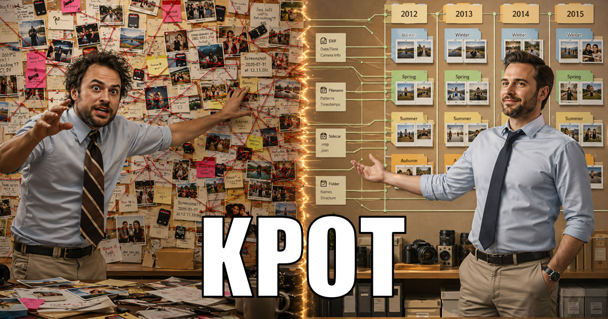

<p align="center">
  
</p>

# KPOT — Krinik Photo Organizer Tool


---

## English

[Читать по-русски →](#русский)

**KPOT — Krinik Photo Organizer Tool.** Chaos in, chronology out: a safety-first CLI tool that turns
a messy home photo/video archive into a browsable chronological library, sorted by year and season —
without ever risking a file you cannot get back.

### Why

Family photos and videos accumulate for decades: random folders with random names, dumps from old
phones and cameras, messenger downloads, duplicates of the same shot scattered under different names
across different directories. The memories are there — but you cannot *browse your life*.

KPOT scans a directory (or a whole drive), figures out **when** each photo/video was taken from
whatever evidence exists — EXIF metadata, dates encoded in filenames (`IMG_20140121_183801.jpg`,
unix-timestamp names, screenshot names…), sidecars, folder names — finds duplicates by content, and
lays everything out as:

```
Library/
├── 2013/
│   ├── Winter (start of year)/
│   ├── Spring/
│   ├── Summer/
│   ├── …
│   └── misc/            ← year is certain, season is not
├── 2014/
│   └── …
└── MISC/                ← date could not be established (never guessed silently)
```

Your custom file names and meaningful folder names survive the sort.

### Safety first — the four guarantees

KPOT **never moves a single file** until all four exist:

1. 🗺️ **A detailed map** — what goes where, and *why* (the evidence behind every date).
2. 💾 **A backup point** the source directory can be rolled back to.
3. 🧪 **A dry run** — a full simulation whose report is all-but-identical to the real run.
4. 📋 **A post-sort report** with a working rollback path.

Every ambiguous case (conflicting dates, suspicious duplicates) is documented and shown in the
pre-sort master plan — never resolved silently. Moves are filesystem *renames*, not copy+delete —
sorting half a terabyte takes minutes, not hours.

### Install

Node.js ≥ 20, nothing else — no build step, no native modules, two runtime dependencies.

```bash
# from the release
npm i -g https://github.com/MikalaiKryvusha/KPOT/releases/download/v0.1/kpot-0.1.0.tgz
kpot --help

# or from source
git clone https://github.com/MikalaiKryvusha/KPOT.git && cd KPOT && npm i
node bin/kpot.mjs --help
```

### Status

🎉 **Release 0.1 “First KPOT”.** Every phase works end to end, and the tool has already sorted real
archives. Verified by **239 green tests** *and* by two supervised runs on real material taken out of
a genuinely messy 551 GB collection — a 3 397-file / 13 GB sample, and a fresh 813-file / 943 MB one.

```
kpot scan <dir>               what each file is, and when it was taken — with the evidence
kpot plan <dir>               the pre-sort master plan you read BEFORE anything moves
kpot apply --dry-run <dir>    full rehearsal, zero writes
kpot apply <dir>              the sort — refuses to start without a verified backup
kpot rollback <run-id> <dir>  everything back where it was
```

**On those real runs:** 3 154 and 813 files sorted, 0 failures either time, and the multiset of
SHA-256 content hashes was *identical* before and after — nothing lost, nothing invented. The
rollback rehearsals restore every file and every folder the sort removed.

What is behind that:

- **Dates from evidence, never from a guess** — [DateVerdict](src/meta/resolve.mjs) per file: EXIF,
  MP4/MOV `mvhd` (our own parser), filename conventions, epoch names, folder names, neighbour-cohort
  inference. Losing evidence stays visible, broken camera clocks are rejected, and *unknown* is a
  real answer instead of a plausible lie.
- **A photo editor cannot fake a capture date** — an export with no `DateTimeOriginal` is never
  shelved by its save date: that date becomes a "taken no later than" ceiling, the XMP identity
  chain (`DerivedFrom` → `DocumentID`) recovers the original's *real* date when the original is in
  the tree, and [camera-family signs](src/meta/family.mjs) (folder camera census, sensor geometry,
  neighbours' year fork) narrow the rest honestly. Measured on the real archive: 199 of 201 such
  files stop living in a false year.
- **Safety that is proven, not promised** — backup (manifest + hardlink snapshot, ~0 bytes on disk)
  before the first write; the dry run executes the *same* code path with inert effects; every intent
  is journalled before it happens; an interrupted run is resumable and one rollback still restores
  the original.
- **It asks instead of guessing** — folders whose name cannot say whether they are yours or a
  program's are set aside in `НА_РАЗБОР/`, keeping their original structure, and only when sorting
  would actually scatter them. You answer in a plain text file; answers survive between runs.
- **A file with no date of its own can borrow its twin's** — a camera writes a `.THM` thumbnail next
  to a video, and [sidecar evidence](src/meta/sidecar.mjs) reads it. That matters more than it
  sounds: AVI carries no container date at all, so on the real archive 25 videos knew only a folder
  year — and now they are dated to the second. The thumbnails themselves go to quarantine, not into
  your gallery.
- **It can find a photo's original by its pixels** — when an editor stripped the capture date, KPOT
  compares the export against the same-camera neighbours step 1 already narrowed down, and inherits
  the original's *real* date only when the best match is decisively ahead of the runner-up — never on
  a threshold ([how, and why a threshold cannot work](researches/06_pixel_original_calibration.md)).
  On one real folder it found `S8305319 +.jpg`'s original at a distance of 30 bits of 1024 with a
  margin of 284; on another, 4 of 4. Where the original is simply not in the archive, it says nothing
  — 94 of 95 such files stayed honestly undated, which is the correct answer, not a missed one.
- **A reset camera clock is not a date** — a "1 January 00:25" claim is refused only when the
  collection itself contradicts it (its year is below the earliest year the archive really holds).
  A genuine New Year photograph of exactly the same shape keeps its date; the owner's archive has 13
  of those, and all 13 are untouched.
- **Idempotent** — sorting an already-sorted library moves nothing.
- Grounded in real chaos: [prior-art research](researches/01_prior_art.md) ·
  [real-archive survey](researches/02_real_archive_survey.md) ·
  [the first real run](researches/03_first_real_run.md), which found four bugs no synthetic fixture
  had · [what a sidecar really contains](researches/04_sidecars.md).

Under way: **the interface** — a local web UI shipped as a portable package (download, unpack,
done), with a wizard for the first run and a control panel afterwards. Design and delivery are
settled: [interview 003](interviews/interview_003_interface.md), with
[clickable mock-ups](interviews/interview_003_designs.html) and the
[prior-art review](researches/07_local_ui_and_delivery.md) behind them; the plan is the
[interface epic](plans/03_interface_epic.md). **Three of its phases have landed** — `kpot ui` starts
a local server and opens a window that walks you through choosing a folder, reading the plan and
sorting, with the four guarantees on screen the whole time. It calls **the same executor** the
terminal does (two implementations would let the dry run and the real run drift apart), it refuses to
sort without your explicit confirmation, and closing the browser does not stop a run. Still ahead:
the control panel, the top-up flow and the portable package.

Roadmap: `MASTER_PLAN.md` · current state: `STATUS.md`.

### Tech

Pure Node.js ≥ 20, ESM (`.mjs`), no build step, near-zero dependencies. Windows-first (long paths,
Cyrillic names, reserved names — all first-class), portable by design. Developed autonomously by AI
agents under the [KAIF framework](https://github.com/MikalaiKryvusha/KAIF) with the owner steering
the vision.

### License

MIT © 2026 Mikalai Kryvusha (KOT KRINIK)

---

## Русский

[Read in English →](#english)

**KPOT — Krinik Photo Organizer Tool.** На входе бардак, на выходе хронология: безопасный
CLI-инструмент, который превращает захламлённый домашний фото-видео архив в удобную хронологическую
библиотеку по годам и сезонам — не рискуя ни одним файлом, который нельзя вернуть.

### Зачем

Семейные фото и видео копятся десятилетиями: случайные папки со случайными названиями, сливы со
старых телефонов и фотоаппаратов, скачанное из мессенджеров, дубликаты одного кадра под разными
именами в разных директориях. Воспоминания есть — а *листать свою жизнь* невозможно.

KPOT сканирует директорию (или целый диск), устанавливает, **когда** снят каждый кадр, по всем
доступным уликам — EXIF-метаданные, даты в именах файлов (`IMG_20140121_183801.jpg`,
unix-timestamp'ы, имена скриншотов…), сайдкары, названия папок — находит дубликаты по содержимому
и раскладывает всё так:

```
Библиотека/
├── 2013/
│   ├── Зима начало года/
│   ├── Весна/
│   ├── Лето/
│   ├── …
│   └── прочее/          ← год известен точно, сезон — нет
├── 2014/
│   └── …
└── ПРОЧЕЕ/              ← дату установить не удалось (никогда не «угадывается» молча)
```

Пользовательские имена файлов и осмысленные названия папок переживают сортировку.

### Безопасность прежде всего — четыре гарантии

KPOT **не переместит ни одного файла**, пока не существуют все четыре:

1. 🗺️ **Подробная карта** — что куда поедет и *почему* (улики за каждой датой).
2. 💾 **Точка бекапа**, к которой исходную директорию можно откатить.
3. 🧪 **Сухой прогон** — полная симуляция, отчёт которой почти 1в1 равен реальному прогону.
4. 📋 **Пост-отчёт** с рабочим путём отката.

Каждый спорный случай (конфликт дат, подозрительный дубликат) документируется и показывается в
пред-сортировочном мастер-плане — ничего не решается молча. Перемещения — это *переименования* в
файловой системе, а не копирование с удалением: сортировка полутерабайта занимает минуты, а не часы.

### Установка

Нужен только Node.js ≥ 20 — ни сборки, ни нативных модулей, две зависимости времени выполнения.

```bash
# из релиза
npm i -g https://github.com/MikalaiKryvusha/KPOT/releases/download/v0.1/kpot-0.1.0.tgz
kpot --help

# или из исходников
git clone https://github.com/MikalaiKryvusha/KPOT.git && cd KPOT && npm i
node bin/kpot.mjs --help
```

### Статус

🎉 **Релиз 0.1 «First KPOT».** Все фазы работают от начала до конца, и инструмент уже разобрал
настоящие архивы. Проверено **239 зелёными тестами** *и* двумя контролируемыми прогонами на живом
материале из по-настоящему захламлённой коллекции на 551 ГБ — на выборке 3 397 файлов / 13 ГБ и на
свежей 813 файлов / 943 МБ.

```
kpot scan <dir>               что за файл и когда снят — вместе с уликами
kpot plan <dir>               пред-сортировочный мастер-план: читаете ДО того, как что-то тронется
kpot apply --dry-run <dir>    полная репетиция, ноль записей
kpot apply <dir>              сортировка — не начнётся без проверенного бэкапа
kpot rollback <run-id> <dir>  всё возвращается как было
```

**Те самые прогоны:** 3 154 и 813 файлов разложены, 0 сбоев в обоих случаях, а множество SHA-256
содержимого до и после — *идентично*: ничего не потеряно и ничего не выдумано. Репетиции отката
возвращают каждый файл и каждую папку, которую убрала сортировка.

Что за этим стоит:

- **Дата из улик, а не из догадки** — [вердикт](src/meta/resolve.mjs) на каждый файл: EXIF, `mvhd`
  из MP4/MOV (собственный парсер), конвенции имён, epoch-имена, названия папок, вывод по соседям.
  Проигравшие улики остаются на виду, сломанные часы камер отвергаются, а «неизвестно» — это
  честный ответ, а не правдоподобная ложь.
- **Фоторедактор не подделает дату съёмки** — экспорт без `DateTimeOriginal` никогда не ложится на
  полку по дате сохранения: она становится потолком «снято не позже», цепочка XMP-идентичности
  (`DerivedFrom` → `DocumentID`) возвращает *настоящую* дату оригинала, если он есть в дереве, а
  [признаки семейства камеры](src/meta/family.mjs) (перепись камер папки, геометрия матрицы, вилка
  лет соседей) честно сужают остальное. Замер на реальном архиве: 199 из 201 такого файла перестают
  жить в ложном году.
- **Безопасность доказанная, а не обещанная** — бэкап (манифест + снимок жёсткими ссылками, ~0 байт
  на диске) до первой записи; сухой прогон идёт *тем же* кодом с отключёнными эффектами; намерение
  пишется в журнал до действия; прерванный прогон продолжается, и один откат всё равно возвращает
  исходное состояние.
- **Спрашивает, а не угадывает** — папки, по имени которых нельзя понять, ваши они или созданы
  программой, откладываются в `НА_РАЗБОР/` со своей исходной структурой — и только если сортировка
  их действительно разорвёт. Отвечаете в обычном текстовом файле, ответы сохраняются между прогонами.
- **Файл без своей даты берёт её у близнеца** — камера кладёт рядом с видео миниатюру `.THM`, и
  [доказательство из сайдкара](src/meta/sidecar.mjs) её читает. Это важнее, чем звучит: у AVI нет
  даты в контейнере вообще, поэтому на реальном архиве 25 видео знали только год папки — а теперь
  датированы до секунды. Сами миниатюры едут в карантин, а не в вашу галерею.
- **Находит оригинал фотографии по её пикселям** — если редактор стёр дату съёмки, KPOT сравнивает
  экспорт с теми же снимками той же камеры, круг которых уже сузил шаг 1, и наследует *настоящую*
  дату оригинала только когда лучший кандидат убедительно оторвался от второго — никогда по порогу
  ([как именно и почему порог не работает](researches/06_pixel_original_calibration.md)). На одной
  реальной папке нашёл оригинал `S8305319 +.jpg` с различием 30 из 1024 бит при отрыве 284; на другой
  — 4 из 4. Там, где оригинала в архиве просто нет, он молчит: 94 из 95 таких файлов честно остались
  без даты, и это правильный ответ, а не упущенный.
- **Сброшенные часы камеры — не дата** — заявке «1 января 00:25» отказывают только если сама
  коллекция ей противоречит (её год ниже того, с которого в архиве реально начинаются снимки).
  Настоящая новогодняя фотография точно такой же формы дату сохраняет: в архиве владельца их 13, и
  все 13 не тронуты.
- **Идемпотентность** — сортировка уже разобранной библиотеки не двигает ничего.
- Опирается на реальный хаос: [исследование готовых решений](researches/01_prior_art.md) ·
  [обзор реального архива](researches/02_real_archive_survey.md) ·
  [первый настоящий прогон](researches/03_first_real_run.md), который нашёл четыре бага, невидимых
  ни одной синтетической фикстуре · [что на самом деле лежит в сайдкаре](researches/04_sidecars.md).

В работе: **интерфейс** — локальный веб-интерфейс, поставляемый портативным пакетом (скачал,
распаковал, готово), с мастером на первый запуск и пультом управления дальше. Дизайн и способ
поставки согласованы: [интервью 003](interviews/interview_003_interface.md), к нему
[кликабельные макеты](interviews/interview_003_designs.html) и
[разведка готовых решений](researches/07_local_ui_and_delivery.md); план — 
[эпик интерфейса](plans/03_interface_epic.md). **Три его фазы уже сделаны:** команда `kpot ui`
поднимает локальный сервер и открывает окно, которое проводит вас по шагам — выбрать папку,
прочитать план, разложить, — и все четыре гарантии всё это время на экране. Окно зовёт **тот же самый
исполнитель**, что и терминал (две реализации означали бы, что сухой прогон и настоящий однажды
разойдутся), сортировка не начнётся без вашего явного подтверждения, а закрытие браузера не
останавливает работу. Впереди: пульт управления, доливка новых файлов и портативный пакет.


Дорожная карта: `MASTER_PLAN.md` · текущее состояние: `STATUS.md`.

### Технологии

Чистый Node.js ≥ 20, ESM (`.mjs`), без сборки, почти без зависимостей. Windows-first (длинные пути,
кириллица, зарезервированные имена — полноценно), переносимый по замыслу. Разрабатывается автономно
ИИ-агентами под фреймворком [KAIF](https://github.com/MikalaiKryvusha/KAIF) под управлением
видения владельца.

### Лицензия

MIT © 2026 Mikalai Kryvusha (KOT KRINIK)
